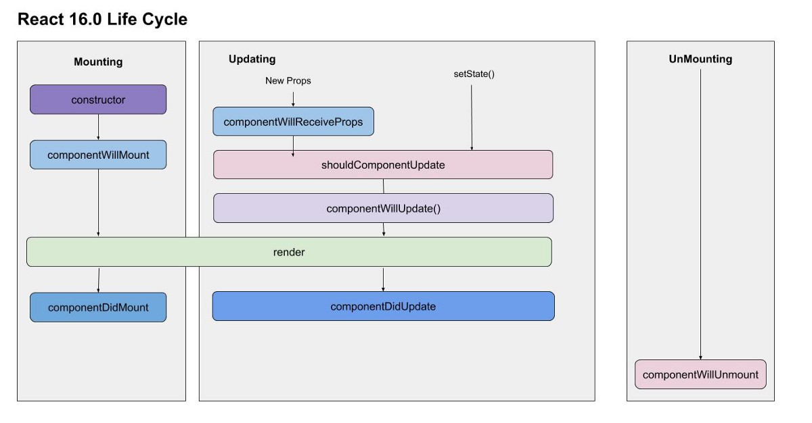
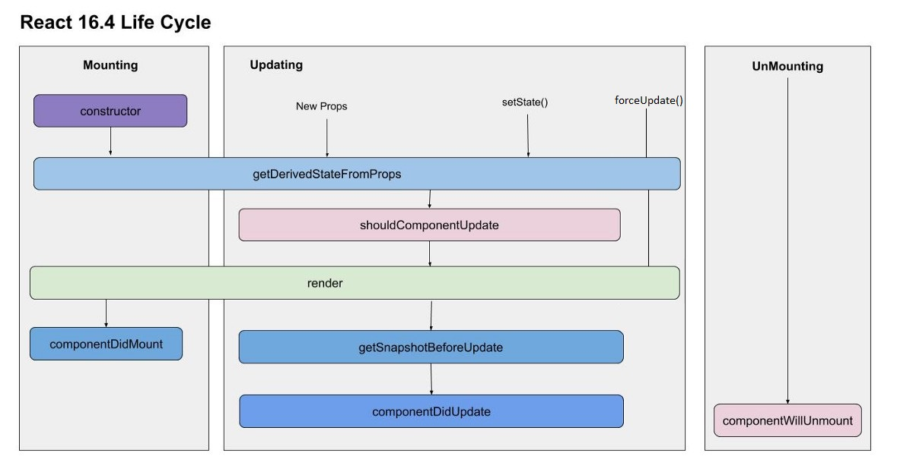

# Getting Started with React Native

## Install Node.js, JDK, Python 2, expo-cli & react-native-cli

* [Getting Started with Expo CLI and React Native CLI](https://facebook.github.io/react-native/docs/getting-started)

1. [Node.js](https://nodejs.org/en/).
2. Install JDK and Python 2 using [Chocolatey](https://chocolatey.org/).
```
@"%SystemRoot%\System32\WindowsPowerShell\v1.0\powershell.exe" -NoProfile -InputFormat None -ExecutionPolicy Bypass -Command "iex ((New-Object System.Net.WebClient).DownloadString('https://chocolatey.org/install.ps1'))" && SET "PATH=%PATH%;%ALLUSERSPROFILE%\chocolatey\bin"
choco install -y python2 jdk8
```
3. Install expo-cli & react-native-cli
```
npm install -g expo-cli
npm install -g react-native-cli
```
4. Install [Android Studio](https://developer.android.com/studio/) following the instructions [Building Projects with Native Code](https://facebook.github.io/react-native/docs/getting-started) documentation.
5. On phone download 'Expo' app.
6. Add the ANDROID_HOME user variable
```
c:\Users\YOUR_USERNAME\AppData\Local\Android\Sdk
```
7. Add platform-tools to user Path variable
```
c:\Users\YOUR_USERNAME\AppData\Local\Android\Sdk\platform-tools
```

## Setting up a new project
* [New React Native App](https://levelup.gitconnected.com/expo-vs-react-native-cli-a-guide-to-bootstrapping-new-react-native-apps-6f0fcafee58f)

1.
```
react-native init myapp
cd myapp
npm install --save react-navigation
```
2. Open the android folder in Android Studio
3. Open Tools > Android > AVD Manager
4. Create new Virtual Device OR Settings > About phone > Sotware information > Build number x7, Enable Settings > Developer Options > USB debugging, ADB WiFi Connect
5. Launch virtual device

6. In terminal run the following commands
```
cd myapp
npm start -- --reset-cache
```

```
cd myapp
react-native run-android
```

## About
* iOS - Swift or Obj-Chocolatey
* Android - Java or Kotlin
* [Ionic](https://ionicframework.com/) renders HTML in app container. Classified as hybrid rather than native mobile app. 
* [Flutter](https://flutter.dev/)

## Learning React, Redux Thunk & Redux Saga
[Pluralsight Free Subscription](https://devopscube.com/pluralsight-free-subscription/)

0. [React.js: Getting Started](https://www.pluralsight.com/courses/react-js-getting-started)
1. [A Practical Start with React](https://app.pluralsight.com/library/courses/react-practical-start)
2. [Redux Thunk Fundamentals](https://app.pluralsight.com/library/courses/redux-fundamentals/table-of-contents)
3. [Redux Saga](https://app.pluralsight.com/library/courses/redux-saga/table-of-contents)

## Learning React Native
* [React Native: Getting Started](https://app.pluralsight.com/library/courses/react-native-getting-started/table-of-contents)

## React Native Stateful Component
```
import React, { Component } from 'react';
import { FlatList, Text } from 'react-native';

class EventList extends Component {
    render()
    {
        return (
            <FlatList
            data={[{key: 'a'}, {key: 'b'}]}
            renderItem={({item}) => <Text>{item.key}</Text>}
            />
        )
    }
}

export default EventList;
```
## React Native Stateful Component with Hooks
```
import React, { useState, useEffect } from 'react';
import { FlatList, Text } from 'react-native';

import EventCard from './EventCard';

const EventList = (props) =>  {
    const [events, setEvents] = useState([]);

    useEffect(() => {
        setInterval(() => {
            setEvents(events.map(evt => ({
                ...evt,
                timer: Date.now(),
              })));
          }, 1000);

        const events = require('./db.json').events.map(e => ({
            ...e,
            date: new Date(e.date),
          }));
          setEvents(events);
    }, []);

    return (
        <FlatList
        data={events}
        renderItem={({item}) => <EventCard event={item}/>}
        keyExtractor={item => item.id}
        />
    )
}

export default EventList;
```
```
import React, { useState, useEffect } from 'react';

const Example = () => {
  // Declare a new state variable, which we'll call "count"
  const [count, setCount] = useState(0);
  
  // Similar to componentDidMount
  useEffect(() => {
    
  }, []);
  
  return (
    
  );
}

export default Example;
```

## React Native Stateless Component
```
import React from 'react';
import {
  Text,
  View,
  StyleSheet,
} from 'react-native';
import PropTypes from 'prop-types';

const styles = StyleSheet.create({
  card: {
    backgroundColor: '#fff',
    flex: 1,
    padding: 10,
    paddingTop: 10,
    paddingBottom: 20,
    margin: 10,
    marginTop: 5,
    marginBottom: 5,
  },
   cardHeader: {
    flex: 1,
    flexDirection: 'row',
  },
  date: {
    fontWeight: '200',
    fontSize: 15,
    color: '#bdbdbd',
    width: '30%',
    textAlign: 'right',
  },
  title: {
    fontSize: 15,
    fontWeight: '300',
    marginLeft: 7,
    textAlign: 'left',
  }
};

export default function EventCard({ event }) {
  return (
      <View style={styles.card}>
        <View style={styles.cardHeader}>
            <Text style={styles.date}>{formatDate(event.date)}</Text>
            <Text style={styles.title}>{event.title}</Text>
        </View>
      </View>
  )
};

EventCard.propTypes = {
  event: PropTypes.shape({
    title: PropTypes.string.isRequired,
    date: PropTypes.instanceOf(Date)
  }),
};
```

## Hooks

* Hooks don’t work inside classes — they let you use React without classes
* useState returns a pair: the current state value and a function that lets you update it.
* The only argument to useState is the initial state.
* The state here doesn’t have to be an object — although it can be if you want. The initial state argument is only used during the first render.
* The Effect Hook, useEffect, adds the ability to perform side effects from a function component. 
* Only call Hooks at the top level. Don’t call Hooks inside loops, conditions, or nested functions.
* Only call Hooks from React function components. Don’t call Hooks from regular JavaScript functions. 
* In a class component we use {this.state.count} but in a function component (aka stateless component) we just use {count}.
* In a class component we use this.setState({ count: this.state.count + 1 } but in a function component (aka stateless component) we just use setCount(count + 1).

```
import React, { useState, useEffect } from 'react';

function Example() {
  // Declare a new state variable, which we'll call "count"
  const [count, setCount] = useState(0);
  const [age, setAge] = useState(42);
  const [fruit, setFruit] = useState('banana');
  const [todos, setTodos] = useState([{ text: 'Learn Hooks' }]);
  
  // Similar to componentDidMount
  useEffect(() => {
    
  }, []);
  
  // Similar to componentDidUpdate
  useEffect(() => {
    
  }, [count]);
  
  // Combination of componentDidMount, componentDidUpdate and ComponentWillUnmount:
  useEffect(() => {
    // Update the document title using the browser API
    document.title = `You clicked ${count} times`;
  });
  
  useEffect(() => {
    ChatAPI.subscribeToFriendStatus(props.friend.id, handleStatusChange);
    return () => {
      ChatAPI.unsubscribeFromFriendStatus(props.friend.id, handleStatusChange);
    };
  });

  return (
    <div>
      <p>You clicked {count} times</p>
      <button onClick={() => setCount(count + 1)}>
        Click me
      </button>
    </div>
  );
}
```
```
import React, { useState, useEffect } from 'react';

const Example = () => {
  // Declare a new state variable, which we'll call "count"
  const [count, setCount] = useState(0);
  const [age, setAge] = useState(42);
  const [fruit, setFruit] = useState('banana');
  const [todos, setTodos] = useState([{ text: 'Learn Hooks' }]);
  
  // Similar to componentDidMount
  useEffect(() => {
    
  }, []);
  
  // Similar to componentDidUpdate
  useEffect(() => {
    
  }, [count]);
  
  // Combination of componentDidMount, componentDidUpdate and ComponentWillUnmount:
  useEffect(() => {
    // Update the document title using the browser API
    document.title = `You clicked ${count} times`;
  });
  
  useEffect(() => {
    ChatAPI.subscribeToFriendStatus(props.friend.id, handleStatusChange);
    return () => {
      ChatAPI.unsubscribeFromFriendStatus(props.friend.id, handleStatusChange);
    };
  });

  return (
    <div>
      <p>You clicked {count} times</p>
      <button onClick={() => setCount(count + 1)}>
        Click me
      </button>
    </div>
  );
}
```

## Lifecycle Methods Creating
1. constructor(props)
2. componentWillMount()
3. render()
4. renderChildComponents
5. componentDidMount() //Called immediately after first render once.

## Lifecycle Methods Updating
* Component shouldComponentUpdate return true. By default update occurs if props or state is set regardless if they have changed.
* PureComponent shouldComponentUpdate will compare props and state value before rendering.

1. componentWillReceiveProps(nextProps) - Only if updated externally - Deprecated
1. static getDerivedStateFromProps(props, state) - return new state based on props or null for no update
2. shouldComponentUpdate(nextProps, nextState) - performance optimization - By default returns true
3. componentWillUpdate(nextProps, nextState) - Deprecated
4. render()
5. getSnapshotBeforeUpdate(prevProps, prevState) - return snapshot object or null. Any value returned by this lifecycle will be passed as a parameter to componentDidUpdate().
6. updateChildComponentProps
7. componentDidUpdate(prevProps, prevState, snapshot)

## Lifecycle Methods Unmount
```
componentWillUnmount()
```

## Lifecycle Methods Error
```
componentDidCatch()
```

## Old vs New Life Cycle
* [React Component Life Cycle Old vs New](https://medium.com/@kartikagarwal01/react-component-lifecycle-old-vs-new-32757aee5850)





## Authors

* **David Ikin**