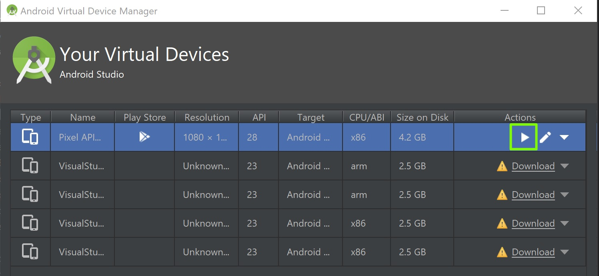

# Getting Started with React Native

## About
* iOS - Swift or Obj-Chocolatey
* Android - Java or Kotlin
* [Ionic](https://ionicframework.com/) renders HTML in app container. Classified as hybrid rather than native mobile app. 
* [Flutter](https://flutter.dev/)
* ES6+, Flow, TypeScript
* Native (UI) and JavaScript (React) threads 
* Use FlatList or SectionList instead of ScrollView

## Debugging Tools
* [reactotron](https://github.com/infinitered/reactotron)
* [remote-redux-devtools](https://github.com/zalmoxisus/remote-redux-devtools)
* [remotedev-server](https://github.com/zalmoxisus/remotedev-server) - [http://localhost:8000](http://localhost:8000) OR [remotedev.io](http://remotedev.io/local/)
* [https://httpstat.us/](https://httpstat.us/)
* [json-server](https://github.com/typicode/json-server)
* [sentry.io](https://sentry.io)

## Useful commands
* Ctrl + M = Open Menu > Enable Hot Reload, Enable Debugging

## Install Node.js, JDK, Python 2, expo-cli & react-native-cli, react-devtools
* [Getting Started with Expo CLI and React Native CLI](https://facebook.github.io/react-native/docs/getting-started)

1. [Node.js](https://nodejs.org/en/).
2. Install JDK and Python 2 using [Chocolatey](https://chocolatey.org/).
```
@"%SystemRoot%\System32\WindowsPowerShell\v1.0\powershell.exe" -NoProfile -InputFormat None -ExecutionPolicy Bypass -Command "iex ((New-Object System.Net.WebClient).DownloadString('https://chocolatey.org/install.ps1'))" && SET "PATH=%PATH%;%ALLUSERSPROFILE%\chocolatey\bin"
choco install -y python2 jdk8
```
3. Install expo-cli & react-native-cli
```
npm install -g expo-cli
npm install -g react-native-cli
npm install -g react-devtools
npm install -g remotedev-server
npm install -g json-server
npm install -g react-native-create-library
```
4. Install [Android Studio](https://developer.android.com/studio/) following the instructions [Building Projects with Native Code](https://facebook.github.io/react-native/docs/getting-started) documentation.
5. On phone download 'Expo' app.
6. Add the ANDROID_HOME user variable
```
c:\Users\YOUR_USERNAME\AppData\Local\Android\Sdk
```
7. Add platform-tools to user Path variable
```
c:\Users\YOUR_USERNAME\AppData\Local\Android\Sdk\platform-tools
```
8. [Install reactotron](https://github.com/infinitered/reactotron)

## Setting up a new project
* [New React Native App](https://levelup.gitconnected.com/expo-vs-react-native-cli-a-guide-to-bootstrapping-new-react-native-apps-6f0fcafee58f)

1.
```
react-native init myapp
cd myapp
npm install --save react-navigation axios redux react-redux redux-persist redux-thunk redux-saga redux-logger reselect ramda @react-native-community/async-storage @react-native-community/slider @react-native-community/viewpager react-native-vector-icons react-native-permissions react-native-firebase react-native-sentry
npm i --save-dev reactotron-react-native reactotron-redux reactotron-redux-saga redux-immutable-state-invariant remote-redux-devtools
react-native link react-native-vector-icons
react-native link @react-native-community/async-storage
react-native link @react-native-community/slider
react-native link @react-native-community/viewpager
react-native link react-native-firebase 
react-native link react-native-sentry
react-native link react-native-device-info
```
2. Open the android folder in Android Studio
3. Open Tools > Android > AVD Manager
4. Create new Virtual Device OR Settings > About phone > Sotware information > Build number x7, Enable Settings > Developer Options > USB debugging, ADB WiFi Connect
5. Launch virtual device


```
cd "%USERPROFILE%\AppData\Local\Android\sdk\emulator" && .\emulator -avd default
```
6. In terminal run the following commands
```
adb reverse tcp:8081 tcp:8081 //debugger
adb reverse tcp:9090 tcp:9090 //reactotron
adb reverse tcp:3000 tcp:3000 //json-server
adb reverse tcp:8000 tcp:8000 //remotedev-server

react-devtools
remotedev --hostname=localhost --port=8000
json-server --host 0.0.0.0 db.json
```
```
cd myapp
npm start -- --reset-cache
```

```
cd myapp
react-native run-android
```

## Project Structure
* components
* config
  * ReactotronConfig.js
* hoc
  * withErrorHandler
    * withErrorHandler.js
  * Wrap.js
* navigators
  * index.js
* screens
  * XXXScreen.js
  * XXXScreen.module.js
* shared
  * utility.js
* store
  * state
    * actions.js
    * actionTypes.js
    * reducers.js
    * sagas.js
      * StorePart
        * actions.js
        * reducer.js
        * sagas.js
        * selectors.js
  * combineReducers.js
  * configureStore.js
  * initSagas.js
* api-request-helper.js
* api.js
* App.js

## Api Logging

index.js
```
if (__DEV__) {
    // Reactotron
    import('./ReactotronConfig').then(() => console.log('Reactotron Configured'));
}
  
import {AppRegistry} from 'react-native';
import App from './App';
import {name as appName} from './app.json';

AppRegistry.registerComponent(appName, () => App);
```

ReactotronConfig.js
```
import Reactotron, {trackGlobalErrors, openInEditor, overlay, asyncStorage, networking} from 'reactotron-react-native'
import {reactotronRedux} from 'reactotron-redux';
import sagaPlugin from 'reactotron-redux-saga';

const reactotron = Reactotron
  .configure({
    name: 'React Native App'
  })
  .use(trackGlobalErrors())
  .use(openInEditor())
  .use(overlay())
  .use(asyncStorage())
  .use(networking())
  .use(reactotronRedux())
  .use(sagaPlugin())
  .useReactNative() // add all built-in react native plugins
  .connect(); // let's connect!

  reactotron.clear();

  export default reactotron
```

## Learning React, Redux Thunk & Redux Saga
[Pluralsight Free Subscription](https://devopscube.com/pluralsight-free-subscription/)

0. [React.js: Getting Started](https://www.pluralsight.com/courses/react-js-getting-started)
1. [A Practical Start with React](https://app.pluralsight.com/library/courses/react-practical-start)
2. [Redux Thunk Fundamentals](https://app.pluralsight.com/library/courses/redux-fundamentals/table-of-contents)
3. [Redux Saga](https://app.pluralsight.com/library/courses/redux-saga/table-of-contents)
4. [Styling React Components](https://app.pluralsight.com/library/courses/react-styling-components/table-of-contents)

## Learning React Native
* [React Native: Getting Started](https://app.pluralsight.com/library/courses/react-native-getting-started/table-of-contents)

## React Native Stateful Component
```
import React, { Component } from 'react';
import { FlatList, Text } from 'react-native';

class EventList extends Component {
    render()
    {
        return (
            <FlatList
            data={[{key: 'a'}, {key: 'b'}]}
            renderItem={({item}) => <Text>{item.key}</Text>}
            />
        )
    }
}

export default EventList;
```
## React Native Stateful Component with Hooks
```
import React, { useState, useEffect, useRef } from 'react';
import { FlatList, Text } from 'react-native';

import EventCard from './EventCard';

const EventList = (props) =>  {
    const [events, setEvents] = useState([]);

    useEffect(() => {
        setInterval(() => {
            setEvents(events.map(evt => ({
                ...evt,
                timer: Date.now(),
              })));
          }, 1000);

        const events = require('./db.json').events.map(e => ({
            ...e,
            date: new Date(e.date),
          }));
          setEvents(events);
    }, []);

    return (
        <FlatList
        data={events}
        renderItem={({item}) => <EventCard event={item}/>}
        keyExtractor={item => item.id}
        />
    )
}

export default EventList;
```
```
import React, { useState, useEffect, useRef } from 'react';

const Example = () => {
  // Declare a new state variable, which we'll call "count"
  const [count, setCount] = useState(0);
  
  // Similar to componentDidMount
  useEffect(() => {
    
  }, []);
  
  return (
    
  );
}

export default Example;
```

## React Native Stateless Component
```
import React from 'react';
import {
  Text,
  View,
  StyleSheet,
} from 'react-native';
import PropTypes from 'prop-types';

const styles = StyleSheet.create({
  card: {
    backgroundColor: '#fff',
    flex: 1,
    padding: 10,
    paddingTop: 10,
    paddingBottom: 20,
    margin: 10,
    marginTop: 5,
    marginBottom: 5,
  },
   cardHeader: {
    flex: 1,
    flexDirection: 'row',
  },
  date: {
    fontWeight: '200',
    fontSize: 15,
    color: '#bdbdbd',
    width: '30%',
    textAlign: 'right',
  },
  title: {
    fontSize: 15,
    fontWeight: '300',
    marginLeft: 7,
    textAlign: 'left',
  }
};

export default function EventCard({ event }) {
  return (
      <View style={styles.card}>
        <View style={styles.cardHeader}>
            <Text style={styles.date}>{formatDate(event.date)}</Text>
            <Text style={styles.title}>{event.title}</Text>
        </View>
      </View>
  )
};

EventCard.propTypes = {
  event: PropTypes.shape({
    title: PropTypes.string.isRequired,
    date: PropTypes.instanceOf(Date)
  }),
};
```

## Navigation
```
npm install --save react-navigation
```

```
import React, {Component} from 'react';
import {Platform} from 'react-native';
import EventList from './components/EventList';
import EventForm from './components/EventForm';
import { createStackNavigator, createAppContainer } from 'react-navigation';

const instructions = Platform.select({
  ios: "Press Cmd+R to reload,\n" + "Cmd+D or shake for dev menu",
  android:
    "Double tap R on your keyboard to reload,\n" +
    "Shake or press menu button for dev menu"
});

const MainNavigator = createStackNavigator({
    list: {screen: EventList,  navigationOptions:() => ({
      title: 'Your Events'
    })},
    form: {screen: EventForm,  navigationOptions:() => ({
      title: 'Add an event'
    })},
  });
  
const App = createAppContainer(MainNavigator);

export default App;
```

```
import React, { useState, useEffect } from 'react';
import { Alert, FlatList, Text } from 'react-native';
import ActionButton from 'react-native-action-button';

import EventCard from './EventCard';
import api from '../api';

const EventList = (props) =>  {
    const [tick, setTick] = useState('');
    const [events, setEvents] = useState([]);

    fetchData = async () => {
        try
        {
          const events = await api.getEvents();
          setEvents(events);
        }
        catch (e) {
          console.error(e);
        }
      }

    useEffect(() => {
        //const events = require('../db.json').events.map(e => ({
            //...e,
            //date: new Date(e.date),
          //}));
          //setEvents(events);

          setInterval(() => {
            setTick(Date.now());
          }, 1000);

          props.navigation.addListener('didFocus', () => {             
            fetchData();
          });
    }, []);

    handleAddEvent = () =>{
        props.navigation.navigate('form');
        props.navigation.goBack();
    }

    return [
        <FlatList
        key="flatlist"
        data={events}
        extraData={tick}
        renderItem={({item}) => <EventCard event={item}/>}
        keyExtractor={item => item.id}
        />,
        <ActionButton key="fab"
            onPress={handleAddEvent}
            buttonColor="rgba(231, 76, 60, 1)"></ActionButton>
    ]
}

export default EventList;
```

## Hooks

* Hooks don’t work inside classes — they let you use React without classes
* useState returns a pair: the current state value and a function that lets you update it.
* The only argument to useState is the initial state.
* The state here doesn’t have to be an object — although it can be if you want. The initial state argument is only used during the first render.
* The Effect Hook, useEffect, adds the ability to perform side effects from a function component. 
* Only call Hooks at the top level. Don’t call Hooks inside loops, conditions, or nested functions.
* Only call Hooks from React function components. Don’t call Hooks from regular JavaScript functions. 
* In a class component we use {this.state.count} but in a function component (aka stateless component) we just use {count}.
* In a class component we use this.setState({ count: this.state.count + 1 } but in a function component (aka stateless component) we just use setCount(count + 1).

```
import React, { useState, useEffect, useRef } from 'react';

function Example() {
  // Declare a new state variable, which we'll call "count"
  const [count, setCount] = useState(0);
  const [age, setAge] = useState(42);
  const [fruit, setFruit] = useState('banana');
  const [todos, setTodos] = useState([{ text: 'Learn Hooks' }]);
  
  // Similar to componentDidMount
  useEffect(() => {
    
  }, []);
  
  // Similar to componentDidUpdate
  useEffect(() => {
    
  }, [count]);

   const prevCount = usePrevious(prevCount);
   const prevSuccess = usePrevious(props.success);
  function usePrevious(value) {
    const ref = useRef();
    useEffect(() => {
      ref.current = value;
    });
    return ref.current;
  }
  
  // Combination of componentDidMount, componentDidUpdate and ComponentWillUnmount:
  useEffect(() => {
    // Update the document title using the browser API
    document.title = `You clicked ${count} times`;
  });
  
  useEffect(() => {
    ChatAPI.subscribeToFriendStatus(props.friend.id, handleStatusChange);
    return () => {
      ChatAPI.unsubscribeFromFriendStatus(props.friend.id, handleStatusChange);
    };
  });

  return (
    <div>
      <p>You clicked {count} times</p>
      <button onClick={() => setCount(count + 1)}>
        Click me
      </button>
    </div>
  );
}
```
```
import React, { useState, useEffect, useRef } from 'react';

const Example = () => {
  // Declare a new state variable, which we'll call "count"
  const [count, setCount] = useState(0);
  const [age, setAge] = useState(42);
  const [fruit, setFruit] = useState('banana');
  const [todos, setTodos] = useState([{ text: 'Learn Hooks' }]);
  
  // Similar to componentDidMount
  useEffect(() => {
    
  }, []);
  
  // Similar to componentDidUpdate
  useEffect(() => {
    
  }, [count]);

   const prevCount = usePrevious(prevCount);
   const prevSuccess = usePrevious(props.success);
  function usePrevious(value) {
    const ref = useRef();
    useEffect(() => {
      ref.current = value;
    });
    return ref.current;
  }
  
  // Combination of componentDidMount, componentDidUpdate and ComponentWillUnmount:
  useEffect(() => {
    // Update the document title using the browser API
    document.title = `You clicked ${count} times`;
  });
  
  useEffect(() => {
    ChatAPI.subscribeToFriendStatus(props.friend.id, handleStatusChange);
    return () => {
      ChatAPI.unsubscribeFromFriendStatus(props.friend.id, handleStatusChange);
    };
  });

  return (
    <div>
      <p>You clicked {count} times</p>
      <button onClick={() => setCount(count + 1)}>
        Click me
      </button>
    </div>
  );
}
```

## Lifecycle Methods Creating
1. constructor(props)
2. componentWillMount()
3. render()
4. renderChildComponents
5. componentDidMount() //Called immediately after first render once.

## Lifecycle Methods Updating
* Component shouldComponentUpdate return true. By default update occurs if props or state is set regardless if they have changed.
* PureComponent shouldComponentUpdate will compare props and state value before rendering.

1. componentWillReceiveProps(nextProps) - Only if updated externally - Deprecated
1. static getDerivedStateFromProps(props, state) - return new state based on props or null for no update
2. shouldComponentUpdate(nextProps, nextState) - performance optimization - By default returns true
3. componentWillUpdate(nextProps, nextState) - Deprecated
4. render()
5. getSnapshotBeforeUpdate(prevProps, prevState) - return snapshot object or null. Any value returned by this lifecycle will be passed as a parameter to componentDidUpdate().
6. updateChildComponentProps
7. componentDidUpdate(prevProps, prevState, snapshot)

## Lifecycle Methods Unmount
```
componentWillUnmount()
```

## Lifecycle Methods Error
```
componentDidCatch()
```

## Old vs New Life Cycle
* [React Component Life Cycle Old vs New](https://medium.com/@kartikagarwal01/react-component-lifecycle-old-vs-new-32757aee5850)


## Set State Cheatsheet
* When setting state in componentDidUpdate it needs to be conditional to prevent an infinite loop.


## Cross Platform
```
const instructions = Platform.select({
  ios: "Press Cmd+R to reload,\n" + "Cmd+D or shake for dev menu",
  android:
    "Double tap R on your keyboard to reload,\n" +
    "Shake or press menu button for dev menu"
});

const style = StyleSheet.create({
	container:{
		flex: 1,
		backgroundColor: 'blue',
		...Platform.select({
		  ios: {
			  backgroundColor: 'red'
		  }
		})
	}
});
```

## Axios API

```
import axios from 'axios';

const client = axios.create({
  baseURL:'http://localhost:3000/'
});

if(__DEV__)
{
  client.interceptors.request.use(request => {
    console.log('Api Request Starting:', request);
    return request;
  }, error => {
    console.log('Api Request Error:', error.message);
    return Promise.reject(error);
  });
  
  client.interceptors.response.use(response => {
    console.log('Api Response Success:', response.data);
    return response;
  }, error => {
    if (error.response) {
      // The request was made and the server responded with a status code
      // that falls out of the range of 2xx
      console.log('Api Response Error:', error.response);
    } else if (error.request) {
      // The request was made but no response was received
      // `error.request` is an instance of XMLHttpRequest in the browser and an instance of
      // http.ClientRequest in node.js
      console.log('Api No Response:', error.request);
    } else {
      // Something happened in setting up the request that triggered an Error
      console.log('Api Request Error:', error.message);
    }
    return Promise.reject(error);
  });
}

class Api {
  constructor(client) {
		this.client = client;
	}
  
   async getEvents() {
    let response = await this.client.get(new Date());
    return response.data;
  }

    async  saveEvent(payload) {
      let response =  await this.client.post('events', { title: payload.title, date: payload.date, id: uuid()});
      return response.data;
    }
}

export default new Api(client);
```

## React Native Components
* View
* KeyboardAvoidingView
* ScrollView (Not virtualized)
* VirtualizedList, FlatList, SectionList
* Image
* Text
* TextInput
* TouchableNativeFeedback, TouchableWithoutFeedback, TouchableOpacity,TouchableHighlight, Button
* AsyncStorage

## React Native Modules
* React-native-camera
* React-native-permissions
* React-native-conteact-list
* React-native-maps
* React-native-image-picker

## Animations
* Add UIManager.setLayoutAnimationEnabledExperimental && UIManager.setLayoutAnimationEnabledExperimental(true); to index.js
* LayoutAnimations in case of easy transitions
* Animations for everything else
* use nativeDriver

## Native Modules
* [react-native-create-library](https://facebook.github.io/react-native/docs/native-modules-setup)
* [react-native-create-bridge](https://github.com/peggyrayzis/react-native-create-bridge)

## Releasing for Android
* (Android Release)[https://flutter.io/android-release/]
1. android\app\build.gradle applicationId "com.example.myapp" must be unique and match with package="com.example.myapp" in android\app\src\main\AndroidMainifest.xml
2. upgrade android\app\src\build.gradle defaultConfig versionCode > Internal and versionName > external each time a release is made.
3. Create a key store
```
keytool -genkey -v -keystore c:\keys\key.jks -keyalg RSA -keysize 2048 -validity 10000 -alias key
```
4. Create new file android\key.properties
```
storePassword=<password from previous step>
keyPassword=<password from previous step>
keyAlias=key
storeFile=C:/keys/key.jks
```
5. Add key.properties to .gitignore
6. add the following lines aboe android in android\app\main\build.gradle
```
def keystorePropertiesFile = rootProject.file("key.properties")
def keystoreProperties = new Properties()
keystoreProperties.load(new FileInputStream(keystorePropertiesFile))

android {
```
7. Replace buildTypes with the following
```
signingConfigs {
    release {
     keyAlias keystoreProperties['keyAlias']
     keyPassword keystoreProperties['keyPassword']
     storeFile file(keystoreProperties['storeFile'])
     storePassword keystoreProperties['storePassword']
  }
}
buildTypes {
  release {
    signingConfig signingConfigs.release
    minifyEnabled enableProguardInReleaseBuilds
    proguardFiles getDefaultProguardFile("proguard-android.txt"), "proguard-rules.pro"
  }
}
```
8. Run the following command
```
cd android
./gradlew assembleRelease
```
9. Outputs to the following directory
```
app\build\outputs\apk\release\app-release.apk
```
10. Run with the following command
```
react-native run-android --variant=release
```
11. Go to Google Play Console

## Tracking Users with Firebase, Crashlytics and Sentry.io
1. Install react-native-firebase
```
npm install react-native-firebase
npm install react-native-sentry --save
react-native link react-native-firebase
react-native link react-native-sentry
```
2. Setup new react native firebase project
3. Analytics.js
```
import Firebase from 'react-native-firebase'

const analytics = Firebase.analytics();
analytics.setAnalyticsCollectionEnabled(true);

const logScreenView = (screenNAme, className) => analytics.setCurrentScreen(screenName, className);

export { logScreenView };
```

4. Usage:

```
import * as Analytics from '../../lib/analytics';

Analytics.logScreenView('NewItemScreen','AddNewItemScreen');
```
5. [sentry.io](https://sentry.io)
6. index.js
```
import { Sentry } from 'react-native-sentry';
Sentry.config('https://xx.xx.xx.io/29875').install();
```
7. android\app\build.grade
```
apply from: "../../node_modules/react-native/react.gradle"

project.ext.sentryCli = [
    logLevel: "debug"
]

apply from: "../../node_modules/react-native-sentry/sentry.gradle"
```
8. android\sentry.properties using [AuthToken](https://sentry.io/settings/account/api/auth-tokens/)
```
defaults.url=https://sentry.io/
defaults.org=david-ikin
defaults.project=react-native
auth.token=
```

## Code Push
* Update JS files without reploying app
* Cannot update native modules

## CI/CD - Bitrise and Fastlane

## Authors

* **David Ikin**